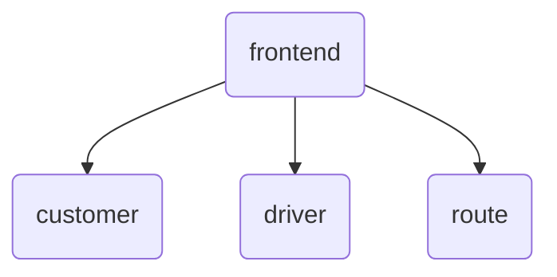
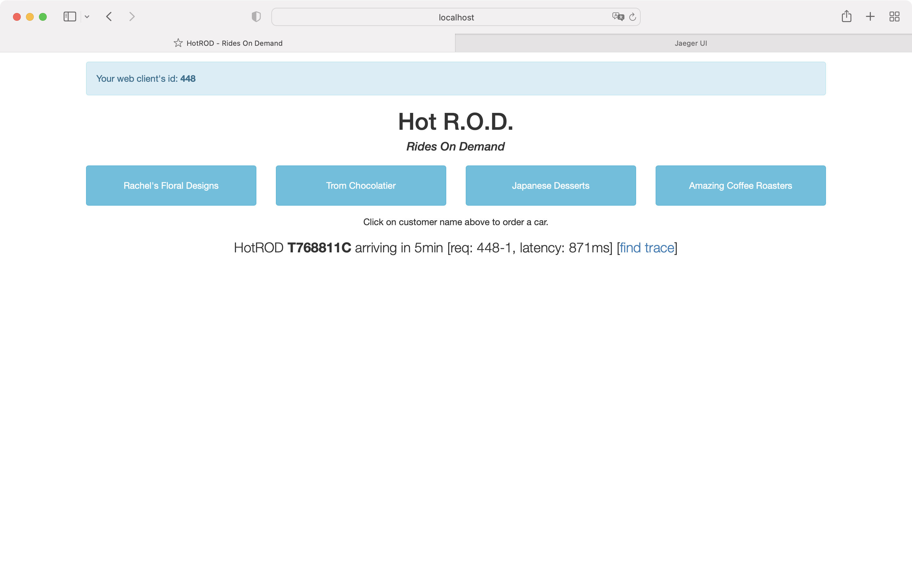
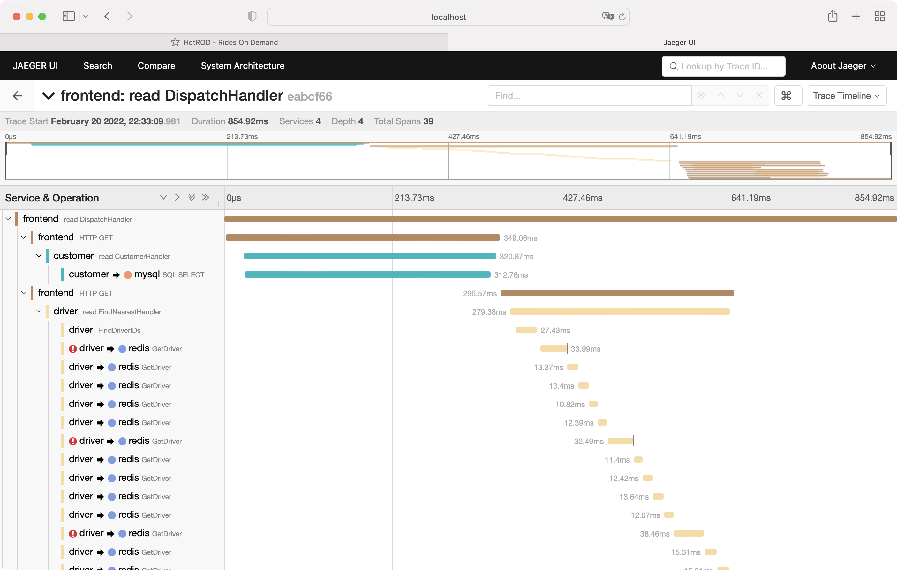
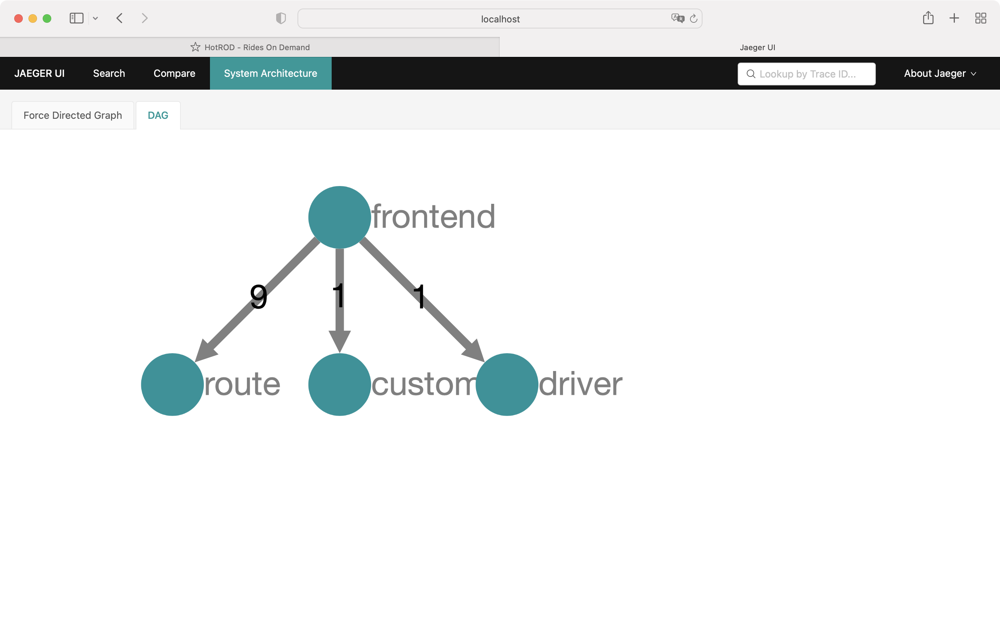

<!--

This source file is part of the Apodini HotROD example open source project

SPDX-FileCopyrightText: 2022 Paul Schmiedmayer and the project authors (see CONTRIBUTORS.md) <paul.schmiedmayer@tum.de>

SPDX-License-Identifier: MIT

-->

# Apodini HotROD Example

This repository includes the HotROD (rides on demand) example as an Apodini web service, mirroring the functionality of [the official Jaeger HotROD Example](https://github.com/jaegertracing/jaeger/tree/main/examples/hotrod). The example is used to showcase the automated distributed tracing functionality of Apodini and consists of four distinct microservices:

- **frontend** serves the user interface and provides the API to request a ride, retrieving information from the other services.
- **customer** mimics a database service the holds the directory of customers.
- **driver** is used to retrieve a list of the nearest drivers by mimicing a Redis interface.
- **route** returns the ETA for a given pickup and dropoff location.

For further information on service functionality, see the [Jaeger HotROD Example README](https://github.com/jaegertracing/jaeger/tree/main/examples/hotrod).

## Run the Apodini HotROD Example

The Apodini HotROD Example services can be started on any system that supports [docker](https://www.docker.com/) and [docker compose](https://docs.docker.com/compose/). Follow the instructions on https://docs.docker.com/compose/install/ to install docker and docker compose. The repository includes a GitHub Action that builds new docker images on every release and pushes the images to the GitHub package registry. To start the services, run the `$ docker compose up -d` command.

## Tracing

When interacting with the service, request handling is traced using the [OpenTelemetry Collector](https://github.com/open-telemetry/opentelemetry-collector-contrib) as the tracing backend. The collector forwards traces to the [Jaeger](https://www.jaegertracing.io) instance that is exposed on port 16686.

The Jaeger user interface displays the collected traces. Each driver request in the HotROD user interface is displayed with a *find trace*  link which opens the trace of the respective request in the Jaeger user interface.

## Development

The `docker-compose-jaeger.yml` file can be used to run the OpenTelemetry collector and Jaeger locally using `$ docker compose -f docker-compose-jaeger.yml up`.

The `docker-compose-development.yml` file can be used to test the setup by building the web services locally and running the OpenTelemetry collector and Jaeger using `$ docker compose -f docker-compose-development.yml up`.

## Continous Integration

The repository contains GitHub Actions to automatically build the HotROD Example web service on a wide variety of platforms and configurations.
